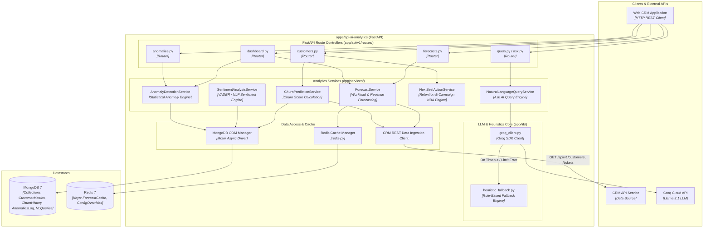

# C4 Level 3: Component Diagram - AI-Analytics Service (`apps/api-ai-analytics`)

This diagram details the internal software architecture of the **AI-Analytics Service** (`apps/api-ai-analytics`), built with Python 3.12, FastAPI, MongoDB, Redis, and Groq LLM API integration.

## Resilience & Architecture Principles
- **LLM Heuristic Fallback**: All natural language query endpoints try Groq API (`llama-3.1-8b-instant`) first; if unreachable or rate-limited, execution safely degrades to `heuristic_fallback.py`.
- **Async Processing**: Built fully asynchronously using Python `async/await`, FastAPI, Motor (Async MongoDB), and `httpx` async client.
- **In-Memory Caching**: Time-series forecast responses and heavy analytical aggregates are cached in Redis to maintain sub-50ms response SLAs.
