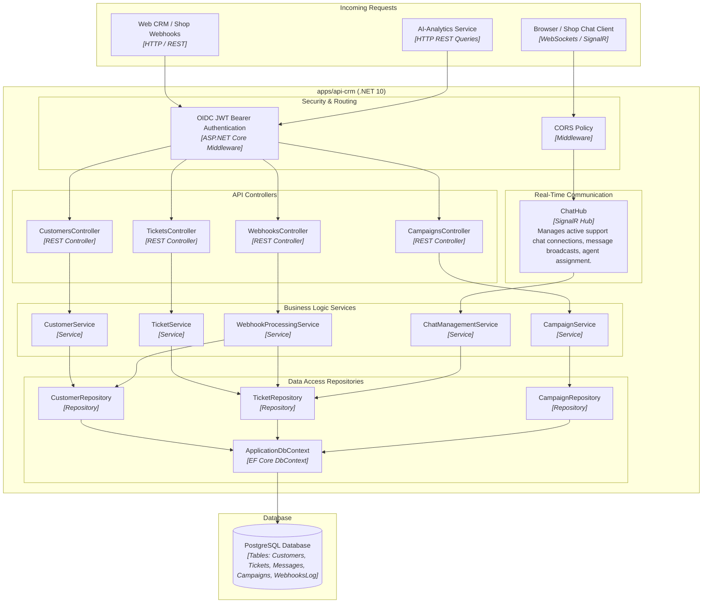

# C4 Level 3: Component Diagram - CRM Core Service (`apps/api-crm`)

This diagram details the internal software architecture of **CRM Core Service** (`apps/api-crm`), illustrating Controller → Service → Repository layering rules in .NET 10.

## Layering Rules Enforced
1. **Controller → Service → Repository**: Controllers delegate all business logic to Services. Repositories handle data persistence using Entity Framework Core.
2. **SignalR ChatHub**: SignalR hub routes live chat messages to `ChatManagementService` and persists conversation threads to PostgreSQL.
3. **Webhooks Endpoint**: `/api/v1/webhooks/*` receives signed JSON payloads from `br-online-shop`, logging events and upserting customer/ticket entities.
