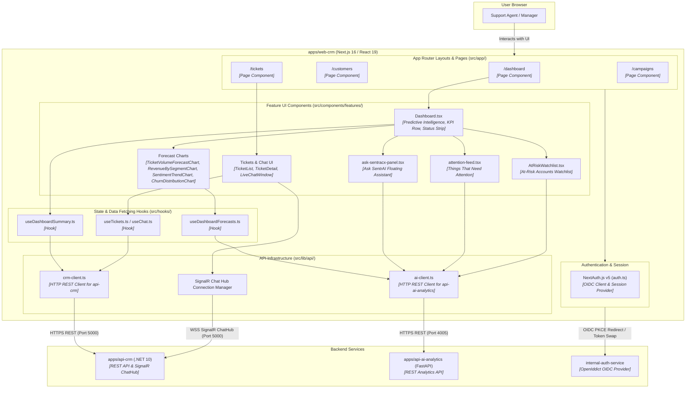

# C4 Level 3: Component Diagram - Web CRM Application (`apps/web-crm`)

This diagram details the frontend application architecture of **Web CRM** (`apps/web-crm`), built with Next.js 16 App Router, React 19, Tailwind CSS v4, and shadcn/ui.

## UI & Component Design Rules
- **shadcn/ui & Tailwind v4**: All UI controls use shadcn/ui components (`new-york`, `neutral`) styled with Tailwind CSS v4 and OKLCH color variables defined in `globals.css`.
- **Lucide Icons**: `lucide-react` is the single authorized icon library across all web components.
- **Strict Component Layering**: Pages render feature containers (`src/components/features/*`), which consume custom hooks (`src/hooks/*`) backed by strongly-typed API wrappers (`crmClient` and `aiClient`).
