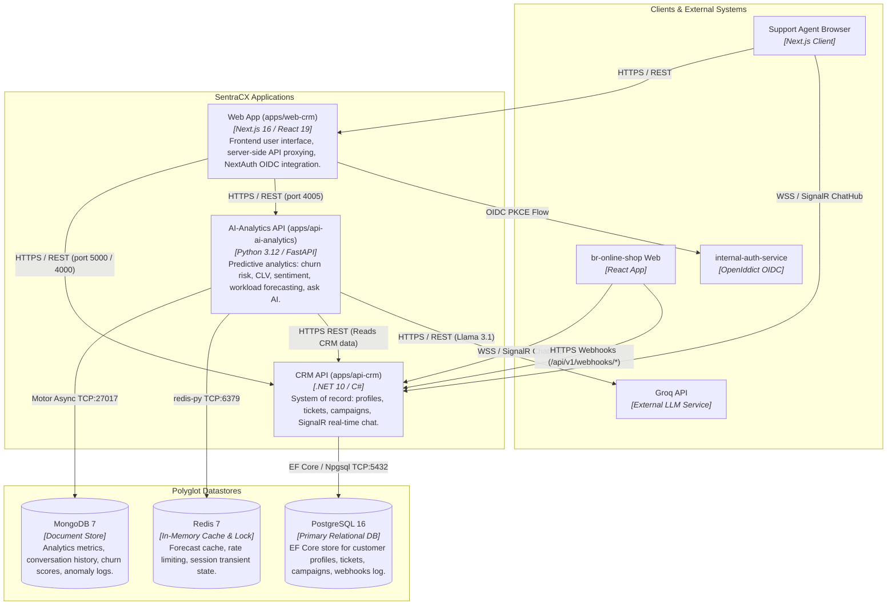

# C4 Level 2: Container Diagram

This diagram shows the high-level architecture of SentraCX's three independently deployable applications, their polyglot datastores, and inter-service communications over REST and WebSockets.

## Technology Stack & Isolation Rules
- **No Shared Databases**: `api-crm` interacts exclusively with **PostgreSQL**. `api-ai-analytics` interacts exclusively with **MongoDB** and **Redis**.
- **REST Communication Only**: `api-ai-analytics` consumes `api-crm` data via REST HTTP APIs. They do not share code or direct DB access.
- **WebSockets / SignalR**: Live support chat connects both internal staff and online shop customers directly to `api-crm`'s SignalR ChatHub.
