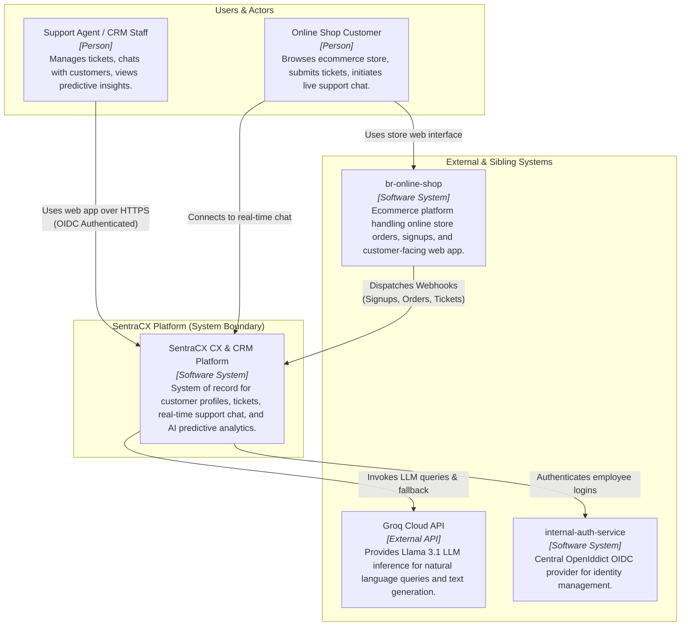

# C4 Level 1: System Context Diagram

This diagram illustrates the high-level boundary of the **SentraCX** Customer Experience & Relationship Management System, identifying external actors, sibling systems, and third-party APIs with which SentraCX interacts.

## Key Interactions Summary
- **Support Staff / CRM Agents**: Authenticate via `internal-auth-service` and interact with the `web-crm` portal.
- **Online Shop Customers**: Interact with `br-online-shop` web app and initiate live support chat connecting directly to `SentraCX`.
- **br-online-shop**: Dispatches real-time HTTPS webhooks for signups, order placements, and customer ticket sync.
- **Groq Cloud API**: Provides fast Llama-3.1 inference for natural language query generation with local heuristic fallbacks.
