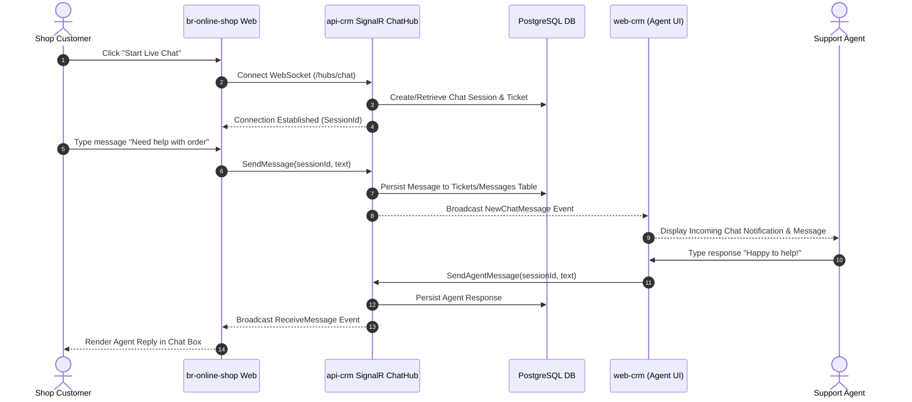
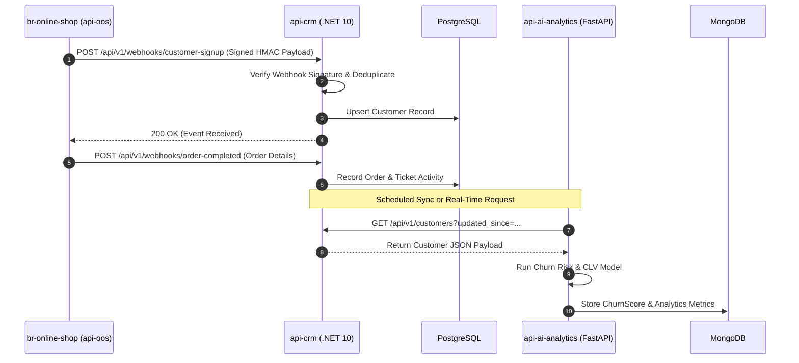
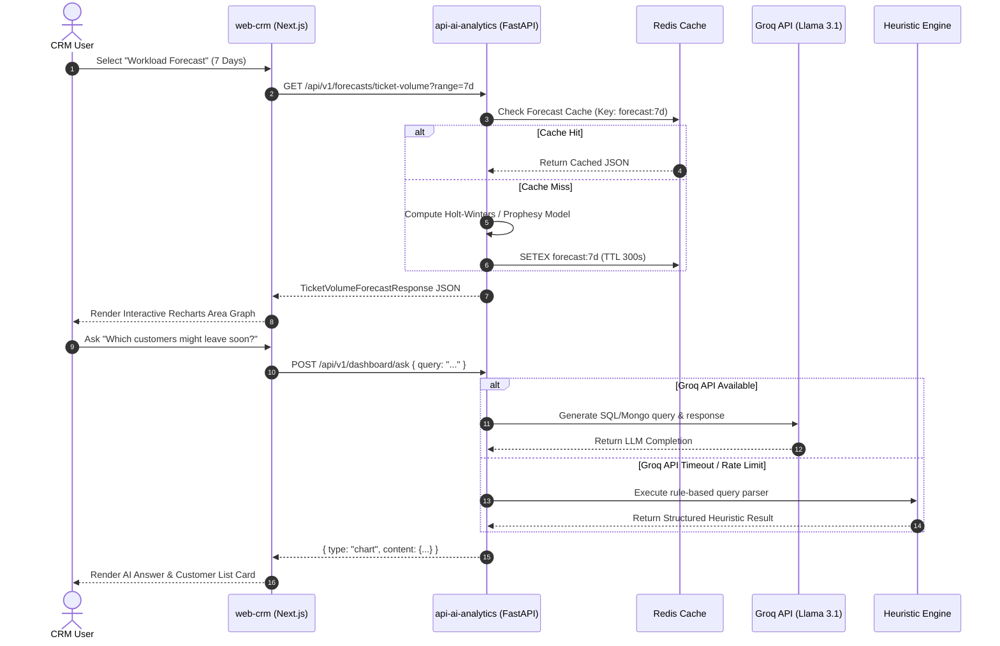
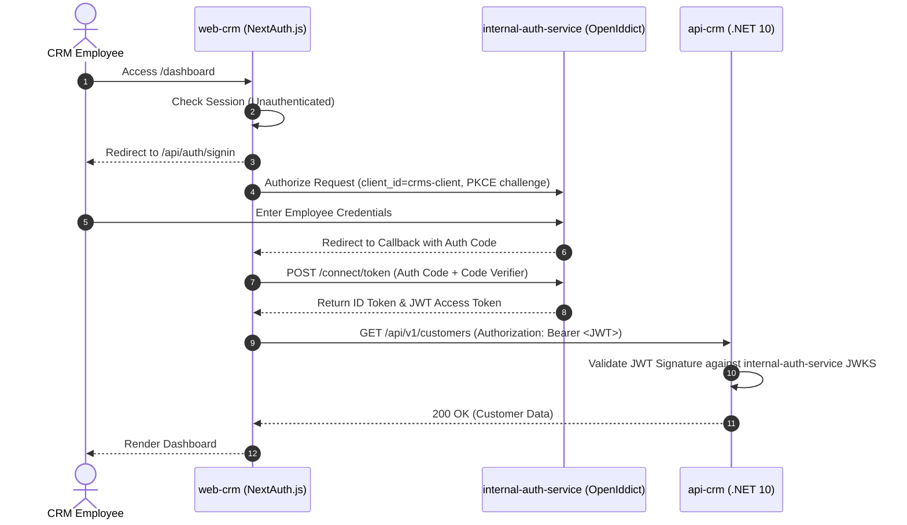

# Technology Interaction & Data Flow Diagrams

This document details sequence flows showing how technologies across **SentraCX** (`apps/web-crm`, `apps/api-crm`, `apps/api-ai-analytics`) and sibling systems (`br-online-shop`, `internal-auth-service`) interact during key operations.

---

## 1. Real-Time Support Chat Interaction Flow

Sequence of real-time support chat between an online shop customer, `api-crm`'s SignalR ChatHub, and a CRM support agent on `web-crm`.

---

## 2. Ecommerce Webhook & AI Analytics Sync Flow

Sequence showing how customer signups and orders from `br-online-shop` trigger webhooks, updating CRM data and feeding the AI-Analytics engine.

---

## 3. Predictive Intelligence & Ask SentrAI Query Flow

Sequence illustrating dashboard predictive chart loading and the Ask SentrAI natural language query workflow with LLM fallback.

---

## 4. Employee OIDC Authentication Flow

Sequence showing employee authentication via `internal-auth-service` (OpenIddict) using PKCE flow.

