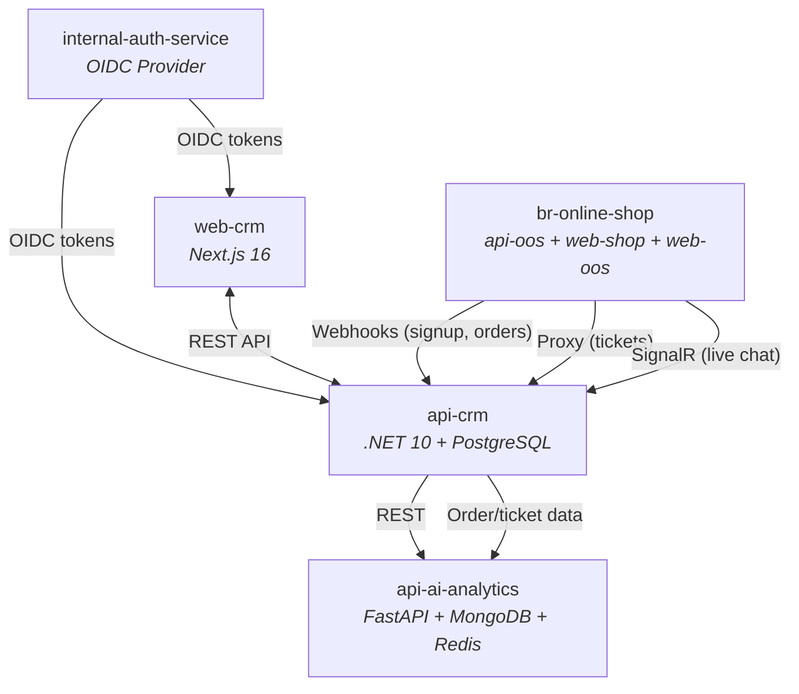
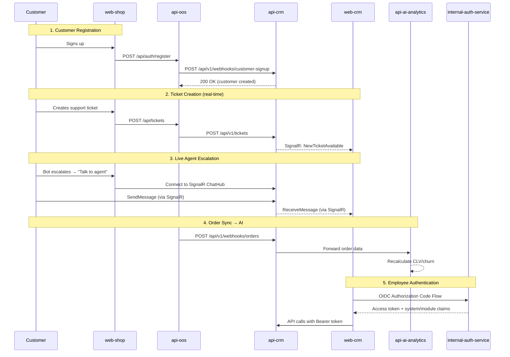

# Product Requirements Document (PRD) — SentraCX

**Smart Engagement Ticketing Relationship and Analytics — Customer Experience**

---

## 1. Overview & Problem Statement

Customer data and support activity for `br-online-shop` are fragmented: order history lives in the ecommerce platform, support requests come in through disconnected channels, and staff have no unified view of a customer's relationship with the company. This makes it hard to spot at-risk customers, respond to support issues quickly, or run targeted marketing campaigns.

**SentraCX** is a centralized CRM and AI-powered customer experience platform that:

- Consolidates customer profiles, order history, tickets, and conversations in one system.
- Syncs in real time with the ecommerce platform (`br-online-shop`) and centralized auth (`internal-auth-service`).
- Uses AI to surface churn risk, prioritize tickets, summarize conversations, and power a customer-facing chatbot.
- Gives leadership a real-time, predictive dashboard instead of retrospective reporting.

**Problem triggers:**

- Support staff lack visibility into a customer's full history when responding to a ticket.
- Marketing cannot segment or target customers based on behavior/purchase data.
- Leadership has no real-time view of support load, churn risk, or campaign performance.
- Customer support is reactive — issues are only addressed after escalation, not predicted.
- Manual processes (data entry, ticket routing, campaign targeting) don't scale with growing order volume.

---

## 2. Goals & Success Metrics

| Goal | Metric | Target |
|---|---|---|
| Reduce customer churn | Monthly churn rate | Reduce by 10–15% within 6 months of launch |
| Faster support resolution | Average ticket resolution time | Reduce by 25% within 3 months; target < 24h for standard tickets |
| Improve support efficiency | Tickets resolved per staff per day | Increase by 20% via AI prioritization and smart replies |
| Increase campaign effectiveness | Campaign conversion rate | Improve by 10% via AI-driven segmentation and targeting |
| Eliminate manual data entry | % of customer/order records auto-synced | 100% — no manual profile creation for ecommerce customers |
| AI adoption and trust | % of AI recommendations accepted (not dismissed) | ≥ 60% acceptance rate within first quarter of AI features live |
| Proactive issue detection | Mean time to detect anomalies | < 5 minutes for ticket volume spikes and sentiment drops |

**Non-goals (this phase):** see Section 4 — Scope.

---

## 3. Target Users & Personas

| Role | Primary needs from SentraCX |
|---|---|
| **Super Admin** | Full system configuration, role management, AI threshold tuning, audit visibility |
| **CEO / VP** | High-level dashboard: churn trends, revenue forecasts, sentiment trends — decision-support, not day-to-day operation |
| **Marketing Manager** | Customer segmentation, campaign creation/scheduling, performance prediction, feedback analytics |
| **Support Assistant / Staff** | Ticket queue, real-time chat with customers, AI-suggested replies and priority, claim/unclaim/complete tickets |
| **Customer (via `br-online-shop`)** | Submit tickets, chat with bot or live agent, leave feedback/ratings, get timely responses |

---

## 4. Scope

### In Scope (this phase)

| Area | Sections |
|---|---|
| Core CRM | Customer profiles, ticketing, real-time chat, campaigns & promotions, feedback (6.1–6.5) |
| Access control | Role-based access via centralized OIDC (6.6) |
| AI intelligence | Customer intelligence, ticket/conversation intelligence, chatbot (6.7–6.9) |
| Analytics | Real-time dashboard, forecasting, anomaly detection, NL query (6.10) |
| Integration | Ecommerce sync, auth-service integration (6.11) |
| Administration | AI config, model governance (6.12) |

### Out of Scope

- **Localization / multi-language** — single language for v1.
- **Native mobile app** — responsive web only; no iOS/Android app.
- **Third-party CRM migration** — no Salesforce/HubSpot import; only `br-online-shop` integration.
- **Voice/phone channel** — chat and ticketing only; no telephony.
- **Multi-tenant / multi-brand** — single company, single ecommerce platform.
- **Social media publishing API** — FR-CRM-06.1 covers channel *recording*, not automated posting to Facebook/Instagram.

---

## 5. Open Questions & Risks

| # | Question / Risk | Impact | Status |
|---|---|---|---|
| 1 | If `internal-auth-service` is down, is there a break-glass fallback for CRM access? | High — all modules blocked | Open |
| 2 | Unauthenticated users can't reach a live agent (FR-AI-03.3). What if they have an urgent billing issue and can't log in? | Medium — potential support gap | Open |
| 3 | Who owns AI model retraining operationally — in-house team or vendor? | Affects NFR-AI-01.1 feasibility | Open |
| 4 | Is this a big-bang launch or phased (core CRM → AI → forecasting)? | Affects sprint planning | Open |
| 5 | NFR-CRM-01.4 targets 10,000 customers — is this the actual expected scale? | Affects architecture decisions | Open |
| 6 | Which LLM provider is used? Is a data processing agreement in place for PII redaction (NFR-AI-01.4)? | Compliance risk | Open |
| 7 | Product reviews exist in both SentraCX (6.5) and `br-online-shop` — which is system of record? | Data duplication risk | Open |

---

## 6. Detailed Requirements

Priority key: **P0** = must-have for launch, **P1** = important (ship within first quarter post-launch), **P2** = nice-to-have (future phase).

### 6.1 Customer Management (P0)

**BR-CRM-01:** The company wants to centralize and manage all customer information and history in one system.

| ID | Functional Requirement | Priority |
|---|---|---|
| FR-CRM-01.1 | The system shall store all customer information in a centralized database. | P0 |
| FR-CRM-01.2 | The system shall maintain customer profiles including contact details (name, email, phone, address). | P0 |
| FR-CRM-01.3 | The system shall track customer order history sourced from the ecommerce platform. | P0 |
| FR-CRM-01.4 | The system shall record customer interactions (messages, complaints, inquiries). | P0 |
| FR-CRM-01.5 | The system shall store customer feedback and ratings. | P1 |
| FR-CRM-01.6 | The system shall automatically create a customer profile when a user registers on `br-online-shop`. | P0 |
| FR-CRM-01.7 | The system shall link CRM customer records to their ecommerce account via external ID for cross-system traceability. | P0 |

| ID | Non-Functional Requirement |
|---|---|
| NFR-CRM-01.1 | **Availability** — Customer information shall be available to authorized users 99% of the time during business hours. |
| NFR-CRM-01.2 | **Security** — Customer data shall be encrypted during transmission (TLS 1.2+) and storage (AES-256). |
| NFR-CRM-01.3 | **Usability** — Customer information shall be searchable and filterable using an intuitive interface requiring no specialized training. |
| NFR-CRM-01.4 | **Scalability** — The system shall support storage and retrieval of at least 10,000 customer records without degradation. |
| NFR-CRM-01.5 | **Idempotency** — Duplicate webhook/event deliveries shall not create duplicate customer records (dedupe by email). |

**Acceptance criteria:**
- A new `br-online-shop` registration creates a CRM customer record within 5 seconds without manual intervention.
- Customer profile page displays order history, marketing history, and interaction timeline.
- Duplicate signup webhook calls do not produce duplicate records.

---

### 6.2 Customer Communication — Ticketing (P0)

**BR-CRM-02:** The company wants customers to communicate concerns, complaints, and requests in the system.

| ID | Functional Requirement | Priority |
|---|---|---|
| FR-CRM-02.1 | The system shall allow customers to submit concerns, complaints, and requests via the ecommerce platform. | P0 |
| FR-CRM-02.2 | The system shall provide a form for submitting concerns (title, description, optional image attachment). | P0 |
| FR-CRM-02.3 | The system shall allow staff to respond to tickets within the system. | P0 |
| FR-CRM-02.4 | The system shall display ticket status (pending, ongoing, completed, cancelled) to both customer and staff. | P0 |
| FR-CRM-02.5 | Tickets created on the ecommerce platform shall appear in real time in the CRM ticketing module without manual refresh. | P0 |
| FR-CRM-02.6 | Staff shall be able to claim, unclaim, and complete tickets. | P0 |
| FR-CRM-02.7 | The system shall support ticket image/file attachments. | P1 |

| ID | Non-Functional Requirement |
|---|---|
| NFR-CRM-02.1 | **Availability** — Ticketing services shall be available 99% of the time. |
| NFR-CRM-02.2 | **Usability** — Ticket submission forms shall be accessible from desktop and mobile devices. |
| NFR-CRM-02.3 | **Reliability** — The system shall prevent loss of submitted tickets and maintain history even during unexpected failures. |
| NFR-CRM-02.4 | **Auditability** — All ticket submissions and responses shall be timestamped and logged. |
| NFR-CRM-02.5 | **Real-time** — Ticket creation events shall propagate to CRM staff within 2 seconds. |

**Acceptance criteria:**
- Customer creates a ticket on `br-online-shop`; it appears in the CRM "Available" tab within 2 seconds.
- Staff claims a ticket; it moves from "Available" to "Claimed" tab in real time for all connected clients.
- Ticket status changes are reflected on both the shop and CRM without page refresh.

---

### 6.3 Real-Time Support Chat (P0)

**BR-CRM-03:** The company wants to support real-time communication between customers and staff.

| ID | Functional Requirement | Priority |
|---|---|---|
| FR-CRM-03.1 | The system shall support real-time messaging between customers and staff via WebSocket/SignalR. | P0 |
| FR-CRM-03.2 | The system shall notify users of new messages (unread badge, notification). | P0 |
| FR-CRM-03.3 | The system shall update conversations dynamically without page refresh. | P0 |
| FR-CRM-03.4 | When a customer requests a human agent (via chatbot escalation), the conversation shall appear in the CRM conversations module in real time. | P0 |
| FR-CRM-03.5 | Both customer and employee shall send and receive messages simultaneously in the same conversation. | P0 |
| FR-CRM-03.6 | The system shall support mark-as-read / mark-as-unread functionality. | P1 |

| ID | Non-Functional Requirement |
|---|---|
| NFR-CRM-03.1 | **Reliability** — Messages shall be persisted to the database regardless of WebSocket delivery success; no message loss. |
| NFR-CRM-03.2 | **Security** — Conversation data shall only be accessible to authorized participants (customer + assigned staff). |
| NFR-CRM-03.3 | **Data Retention** — Conversation history shall be retained for a minimum of one year. |
| NFR-CRM-03.4 | **Latency** — Message delivery latency shall be under 500ms for connected clients. |
| NFR-CRM-03.5 | **Reconnection** — On WebSocket reconnect, missed messages shall be retrievable via API backfill. |

**BR-CRM-04:** The company wants an internal messaging system linked to support tickets.

| ID | Functional Requirement | Priority |
|---|---|---|
| FR-CRM-04.1 | The system shall provide an in-system chat feature linked to support tickets (each ticket has one conversation). | P0 |
| FR-CRM-04.2 | The system shall store full conversation history with timestamps. | P0 |
| FR-CRM-04.3 | Staff shall be able to mark tickets as completed or unclaim them from within the conversation view. | P0 |

**Acceptance criteria:**
- Customer sends a message on `br-online-shop`; staff sees it in < 500ms in the CRM conversation window.
- Staff replies; customer sees the response in < 500ms on the shop.
- If WebSocket disconnects and reconnects, missed messages are fetched and displayed.
- Conversation history is preserved and viewable after ticket completion.

---

### 6.4 Marketing & Promotions (P0)

**BR-CRM-05:** The company wants to send promotions, announcements, and discounts to customers.

| ID | Functional Requirement | Priority |
|---|---|---|
| FR-CRM-05.1 | The system shall allow creation of promotional campaigns with title, subject, description, and optional images. | P0 |
| FR-CRM-05.2 | The system shall allow sending promotions to targeted customer groups/segments. | P0 |
| FR-CRM-05.3 | The system shall support multiple delivery channels: email and in-app notifications. | P0 |
| FR-CRM-05.4 | The system shall allow targeting specific customer segments (by type, status, AI-derived segment). | P0 |
| FR-CRM-05.5 | The system shall support campaign scheduling: immediate, scheduled (specific date/time), and recurring (specific weekdays). | P0 |
| FR-CRM-05.6 | The system shall allow linking multiple promotions to a campaign. | P0 |
| FR-CRM-05.7 | The system shall support saving campaigns as drafts with partial data. | P1 |
| FR-CRM-05.8 | The system shall auto-stop campaigns when their end date elapses. | P0 |

**BR-CRM-06:** The company wants to utilize multiple marketing platforms for promotions.

| ID | Functional Requirement | Priority |
|---|---|---|
| FR-CRM-06.1 | The system shall allow recording which marketing channels were used per campaign (Facebook, Instagram, Email, etc.). | P0 |
| FR-CRM-06.2 | The system shall support promotion types: discount, voucher, free shipping, buy-one-get-one, cashback. | P0 |

| ID | Non-Functional Requirement |
|---|---|
| NFR-CRM-06.1 | **Reliability** — Scheduled campaigns shall execute within 5 minutes of their configured send time. |
| NFR-CRM-06.2 | **Validation** — Promotion field requirements shall be enforced per type (e.g., discount value required for discount type, voucher code required for voucher type). |

**Acceptance criteria:**
- Marketing Manager creates a campaign targeting "High-Value" segment, schedules it for next Monday — campaign sends within 5 minutes of scheduled time.
- A promotion linked to a campaign auto-marks as "accomplished" after its end date passes.
- Drafts are saveable with incomplete data; only published campaigns require all fields.

---

### 6.5 Customer Feedback & Ratings (P1)

**BR-CRM-07:** The company wants to collect and manage customer feedback and ratings.

| ID | Functional Requirement | Priority |
|---|---|---|
| FR-CRM-07.1 | The system shall allow customers to submit feedback and ratings (1–5 star scale, max 500 characters text). | P1 |
| FR-CRM-07.2 | The system shall store feedback linked to both the customer and the product. | P1 |
| FR-CRM-07.3 | The system shall allow admin/marketing users to view, filter, and analyze feedback. | P1 |
| FR-CRM-07.4 | The system shall compute and display average ratings per product. | P1 |

| ID | Non-Functional Requirement |
|---|---|
| NFR-CRM-07.1 | **Validation** — 500-character maximum and 1–5 rating range shall be enforced server-side. |
| NFR-CRM-07.2 | **Uniqueness** — One feedback submission per customer per product (no duplicate reviews). |
| NFR-CRM-07.3 | **Privacy** — Feedback display shall show rating, text, and date only — no reviewer PII exposed publicly. |

**Acceptance criteria:**
- Customer submits a 4-star review with 200 characters of text — it appears in the product's feedback list.
- Same customer attempting a second review for the same product receives an error.
- Admin can filter feedback by rating range, date, and product.

---

### 6.6 Role-Based Access Control & Authentication (P0)

**BR-CRM-08:** The company wants to control system access based on user roles, integrated with the centralized identity provider.

| ID | Functional Requirement | Priority |
|---|---|---|
| FR-CRM-08.1 | The system shall support roles: Super Admin, CEO, VP, Marketing Manager, Support Assistant, Staff/Employee. | P0 |
| FR-CRM-08.2 | The system shall restrict feature access based on assigned roles. | P0 |
| FR-CRM-08.3 | Administrators shall be able to assign and manage user roles via the auth service. | P0 |
| FR-CRM-08.4 | The system shall enforce module-level permissions (Dashboard, Customer Profiles, Campaigns, Conversations, Tickets). | P0 |
| FR-CRM-08.5 | The system shall authenticate users exclusively via the centralized OIDC provider (`internal-auth-service`). | P0 |
| FR-CRM-08.6 | Only employees with granted CRMS system access in the auth service shall be able to use SentraCX. | P0 |
| FR-CRM-08.7 | Users without access to a specific module shall not see it in navigation or be able to reach it via direct URL. | P0 |

| ID | Non-Functional Requirement |
|---|---|
| NFR-CRM-08.1 | **Security** — Permission checks shall be enforced server-side on every API request (not client-side only). |
| NFR-CRM-08.2 | **Authentication** — All sessions shall be backed by valid OIDC tokens; expired tokens shall force re-authentication. |
| NFR-CRM-08.3 | **SSO** — Users shall authenticate once via `internal-auth-service` and access SentraCX without re-entering credentials. |
| NFR-CRM-08.4 | **Least Privilege** — Default new user accounts shall have no module access until explicitly granted. |

**Acceptance criteria:**
- Unauthenticated user accessing any SentraCX URL is redirected to `internal-auth-service` login.
- Authenticated user without CRMS access sees "Access Denied" page.
- Support Assistant can access Tickets and Conversations but cannot see Campaigns or Admin settings.
- Super Admin can access all modules including Admin configuration.

---

### 6.7 AI-Powered Customer Intelligence (P1)

**BR-AI-01:** The company wants AI-driven insights to proactively manage customer relationships and reduce churn.

| ID | Functional Requirement | Priority |
|---|---|---|
| FR-AI-01.1 | The system shall segment customers into categories (New, High-Value, At-Risk, Dormant, Loyal) based on behavior and purchase history. | P1 |
| FR-AI-01.2 | The system shall predict churn risk for each customer and display a risk score (0–1) with contributing factors. | P1 |
| FR-AI-01.3 | The system shall predict Customer Lifetime Value (CLV) based on purchase history and behavior patterns. | P1 |
| FR-AI-01.4 | The system shall recommend next-best-actions per customer (e.g., retention offer, follow-up call) with accept/dismiss/complete feedback loop. | P1 |
| FR-AI-01.5 | The system shall display AI insights (segment, churn score, CLV, recommendation) on the customer profile page. | P1 |
| FR-AI-01.6 | The system shall allow staff to filter and sort customer lists by segment, churn risk, and CLV. | P1 |

| ID | Non-Functional Requirement |
|---|---|
| NFR-AI-01.1 | **Freshness** — AI scores shall be recomputed at least daily; cached scores shall not exceed 24 hours of staleness. |
| NFR-AI-01.2 | **Confidence** — All AI outputs shall include a confidence score (0–1); outputs below the configured threshold shall be withheld or marked "Unclassified." |
| NFR-AI-01.3 | **Graceful Degradation** — If the AI service is unavailable, CRM features shall continue to function without AI data; the UI shall display an "AI unavailable" state rather than errors or blank content. |
| NFR-AI-01.4 | **Privacy** — PII shall be redacted or anonymized before being sent to any external LLM provider. No raw customer names, emails, or phone numbers shall leave the system boundary. |
| NFR-AI-01.5 | **Configurability** — Churn threshold, confidence thresholds, and scoring weights shall be admin-configurable (see 6.12). |

**Acceptance criteria:**
- Customer profile shows segment badge, churn score with contributing factors, CLV, and next-best-action card.
- Staff accepts a recommendation → it's logged; next time the model runs, acceptance feedback influences the output.
- AI service goes down → customer profile still loads; AI section shows "Insights temporarily unavailable" with last-computed timestamp.
- Admin changes churn threshold from 0.7 to 0.6 → more customers flagged as at-risk on next recomputation.

---

### 6.8 AI-Powered Ticket & Conversation Intelligence (P1)

**BR-AI-02:** The company wants AI to automatically analyze, categorize, and prioritize support tickets and conversations.

| ID | Functional Requirement | Priority |
|---|---|---|
| FR-AI-02.1 | On ticket creation, the system shall auto-assign sentiment (positive/neutral/negative), category (billing, shipping, technical, complaint, refund, etc.), and priority score. | P1 |
| FR-AI-02.2 | The system shall predict estimated resolution time for each ticket based on category and historical data. | P2 |
| FR-AI-02.3 | The system shall perform real-time sentiment analysis per message in live conversations. | P1 |
| FR-AI-02.4 | The system shall flag conversations for escalation when sentiment trends negative (automatic escalation indicator). | P1 |
| FR-AI-02.5 | The system shall generate on-demand conversation summaries for staff (useful on reassignment or ticket completion). | P1 |
| FR-AI-02.6 | The system shall suggest contextual smart replies for staff during conversations. | P2 |
| FR-AI-02.7 | The system shall detect customer intent per message (question, complaint, refund request, general inquiry). | P1 |
| FR-AI-02.8 | The system shall extract key entities from conversations (product names, order numbers, dates) and link them to relevant records. | P2 |

| ID | Non-Functional Requirement |
|---|---|
| NFR-AI-02.1 | **Latency** — Ticket analysis (sentiment + category + priority) shall complete within 2 seconds of submission. |
| NFR-AI-02.2 | **Fallback** — Low-confidence categorizations shall default to "Uncategorized" (requires manual tagging); low-confidence sentiment shall default to "Neutral/Unclassified." |
| NFR-AI-02.3 | **Transparency** — AI-suggested values shall be visually distinguished from manually confirmed values in the UI (e.g., "AI" badge). |
| NFR-AI-02.4 | **Override** — Staff shall always be able to manually override AI-assigned categories, priorities, and sentiment labels. |

**Acceptance criteria:**
- New ticket auto-receives sentiment, category, and priority within 2 seconds — visible in ticket list and detail view.
- Low-confidence ticket (< threshold) shows "Uncategorized" with a prompt for manual tagging.
- Staff clicks "Generate Summary" on a 20-message conversation → summary appears within 3 seconds.
- Sentiment trending negative across 3+ messages → escalation flag appears for staff.

---

### 6.9 AI Chatbot (P0)

**BR-AI-03:** The company wants an AI chatbot on the ecommerce platform that provides tiered support based on customer authentication state.

| ID | Functional Requirement | Priority |
|---|---|---|
| FR-AI-03.1 | The chatbot shall be available to all visitors on `br-online-shop` (authenticated or not). | P0 |
| FR-AI-03.2 | **Unauthenticated scope:** Users shall only be able to ask about general shop information — store hours, product catalog, shipping policies, FAQ. | P0 |
| FR-AI-03.3 | **Unauthenticated restriction:** Users shall NOT be able to request a live agent, view order history, or access account-specific information. The bot shall prompt them to log in. | P0 |
| FR-AI-03.4 | **Authenticated scope:** Users shall be able to ask about their orders, account details, and ticket history via the bot. | P0 |
| FR-AI-03.5 | **Authenticated escalation:** Users shall be able to request escalation to a live human agent. | P0 |
| FR-AI-03.6 | On escalation, the system shall automatically create a support ticket and connect the customer to the CRM's real-time chat. | P0 |
| FR-AI-03.7 | The bot conversation history shall be passed to the human agent as context (summary + full transcript) when escalation occurs. | P0 |
| FR-AI-03.8 | The chatbot shall classify query intent to determine whether to respond with FAQ, fetch order data, or escalate. | P1 |

| ID | Non-Functional Requirement |
|---|---|
| NFR-AI-03.1 | **Latency** — Bot replies shall be generated within 3 seconds. |
| NFR-AI-03.2 | **Availability** — The chatbot shall be available 99% of the time, independent of live agent availability. |
| NFR-AI-03.3 | **Safety** — The chatbot shall not disclose other customers' data, internal system details, or execute instructions injected in user messages. |
| NFR-AI-03.4 | **Graceful Degradation** — If the AI/LLM service is down, the chatbot shall display a static fallback message directing users to submit a support ticket manually. |

**Acceptance criteria:**
- Unauthenticated visitor asks "What are your shipping options?" → bot responds with relevant FAQ.
- Unauthenticated visitor asks "Where is my order?" → bot responds "Please log in to view your order status" with login link.
- Authenticated user asks "Where is my order #1234?" → bot returns order status from ecommerce data.
- Authenticated user clicks "Talk to agent" → ticket is created, conversation connects to CRM ChatHub, and staff sees it in Conversations tab within 2 seconds.
- Human agent opening the escalated conversation sees a summary of the bot exchange at the top.

---

### 6.10 Dashboard, Forecasting & Predictive Analytics (P1)

**BR-DASH-01:** The company wants a unified dashboard with real-time operational visibility and predictive insights for proactive decision-making.

| ID | Functional Requirement | Priority |
|---|---|---|
| FR-DASH-01.1 | The dashboard shall display KPIs: active tickets, average resolution time, churn rate, average CLV, customer sentiment score, and active campaigns. | P1 |
| FR-DASH-01.2 | Each KPI shall show trend direction (↑↓) and percentage delta versus the previous period. | P1 |
| FR-DASH-01.3 | The dashboard shall support configurable date range filtering for all metrics. | P1 |
| FR-DASH-01.4 | The dashboard shall update operational metrics (tickets in queue, escalations, unread conversations) in real time without page refresh. | P1 |

**BR-DASH-02:** The company wants predictive forecasting to anticipate demand and allocate resources proactively.

| ID | Functional Requirement | Priority |
|---|---|---|
| FR-DASH-02.1 | The system shall forecast ticket volume for the next 7, 14, and 30 days based on historical patterns and scheduled campaigns. | P1 |
| FR-DASH-02.2 | The system shall project revenue based on aggregated CLV predictions across customer segments. | P2 |
| FR-DASH-02.3 | The system shall show churn risk distribution (Low/Medium/High/Critical buckets) and weekly trend. | P1 |
| FR-DASH-02.4 | The system shall forecast sentiment trends and alert when predicted to drop below a configurable threshold. | P2 |
| FR-DASH-02.5 | The system shall predict campaign performance (open rate, click rate, conversion rate) before send. | P2 |
| FR-DASH-02.6 | The system shall compare ticket volume forecasts against staffing capacity and alert when demand exceeds resources. | P1 |

**BR-DASH-03:** The company wants proactive anomaly detection and alerting.

| ID | Functional Requirement | Priority |
|---|---|---|
| FR-DASH-03.1 | The system shall detect anomalies: ticket volume spikes, sentiment drops, churn rate elevations, unusual order cancellation patterns. | P1 |
| FR-DASH-03.2 | The system shall classify anomaly severity (low/medium/high/critical). | P1 |
| FR-DASH-03.3 | The dashboard shall display an anomaly feed with acknowledge/dismiss actions. | P1 |
| FR-DASH-03.4 | Critical anomalies shall trigger real-time toast notifications to logged-in staff. | P1 |

**BR-DASH-04:** The company wants natural language querying for analytics accessibility.

| ID | Functional Requirement | Priority |
|---|---|---|
| FR-DASH-04.1 | The system shall accept plain-English questions and return relevant data as tables, charts, or single values. | P2 |
| FR-DASH-04.2 | The system shall provide suggested/example queries to guide non-technical users. | P2 |

| ID | Non-Functional Requirement |
|---|---|
| NFR-DASH-01.1 | **Freshness** — Real-time metrics shall update within 2 seconds of the triggering event. |
| NFR-DASH-01.2 | **Performance** — Dashboard initial load shall complete within 3 seconds on standard connections. |
| NFR-DASH-01.3 | **Accuracy** — Forecast models shall be evaluated monthly; accuracy below 70% shall trigger model retraining. |
| NFR-DASH-01.4 | **Configurability** — Anomaly thresholds, staffing capacity, and alert sensitivity shall be admin-configurable without code changes. |

**Acceptance criteria:**
- Dashboard loads in < 3 seconds showing all 6 KPI cards with trend deltas.
- Staff creates a ticket → "Active Tickets" KPI increments within 2 seconds without page refresh.
- Ticket volume forecast chart shows historical (solid line) + predicted (dashed line) with confidence band.
- Staffing alert fires when forecast exceeds configured agent capacity by > 20%.
- Anomaly detected (e.g., ticket spike) → toast notification appears for all logged-in dashboard users.

---

### 6.11 Cross-System Integration (P0)

**BR-INT-01:** The company wants the CRM to automatically sync customer and order data from the ecommerce platform without manual data entry.

| ID | Functional Requirement | Priority |
|---|---|---|
| FR-INT-01.1 | When a user registers on `br-online-shop`, a customer profile shall be automatically created in the CRM. | P0 |
| FR-INT-01.2 | When an order is placed, shipped, delivered, or cancelled, the event shall be reflected in the customer's order history in the CRM. | P0 |
| FR-INT-01.3 | The CRM customer record shall store the ecommerce user ID for cross-system linking (no manual mapping). | P0 |

**BR-INT-02:** The company wants support interactions originating from the ecommerce platform to flow into the CRM in real time.

| ID | Functional Requirement | Priority |
|---|---|---|
| FR-INT-02.1 | Tickets created on `br-online-shop` shall appear in the CRM tickets module in real time. | P0 |
| FR-INT-02.2 | When a customer requests a human agent via chatbot, the conversation shall appear in the CRM conversations module in real time. | P0 |
| FR-INT-02.3 | Bi-directional real-time messaging shall work cross-system: customer messages on the shop appear in CRM; staff replies appear on the shop. | P0 |

**BR-INT-03:** The company wants the CRM integrated with the centralized authentication service for employee access.

| ID | Functional Requirement | Priority |
|---|---|---|
| FR-INT-03.1 | SentraCX shall authenticate employees exclusively via `internal-auth-service` (OpenIddict OIDC). | P0 |
| FR-INT-03.2 | Only employees with CRMS system access granted in the auth service shall be able to use SentraCX. | P0 |
| FR-INT-03.3 | Module-level permissions configured in the auth service shall be enforced in SentraCX at both UI and API levels. | P0 |

| ID | Non-Functional Requirement |
|---|---|
| NFR-INT-01.1 | **Resilience** — Webhook delivery failures shall not break the primary operation on `br-online-shop`; retries with exponential backoff shall be used. |
| NFR-INT-01.2 | **Idempotency** — All sync operations shall be idempotent; duplicate event delivery shall not create duplicate records. |
| NFR-INT-01.3 | **Latency** — Real-time integrations (tickets, chat) shall propagate within 2 seconds. |
| NFR-INT-01.4 | **Isolation** — Integration failures shall be logged and alerted but shall never crash or degrade the source system (`br-online-shop`). |

**Acceptance criteria:**
- New user registers on `br-online-shop` → CRM customer record appears within 5 seconds.
- Order placed on shop → appears in customer's "Order History" tab in CRM.
- Same signup webhook fired twice → only one CRM record exists.
- `api-crm` is temporarily down → `br-online-shop` continues operating normally; webhook retries succeed after recovery.
- Staff in CRM sends a message → customer sees it on `br-online-shop` within 500ms.

---

### 6.12 Admin Configuration & Model Governance (P1)

**BR-ADMIN-01:** The company wants administrators to configure AI behavior and thresholds without code changes.

| ID | Functional Requirement | Priority |
|---|---|---|
| FR-ADMIN-01.1 | The system shall provide an admin settings page for configuring: churn threshold, priority weights, anomaly sensitivity, confidence thresholds, and staffing capacity. | P1 |
| FR-ADMIN-01.2 | Configuration changes shall be audit-logged (who changed what, when, previous value, new value). | P1 |
| FR-ADMIN-01.3 | The admin settings page shall be restricted to Super Admin and Manager roles only. | P0 |
| FR-ADMIN-01.4 | Configuration changes shall take effect immediately without requiring service restart. | P1 |

**BR-ADMIN-02:** The company wants visibility into AI model lifecycle for compliance and trust.

| ID | Functional Requirement | Priority |
|---|---|---|
| FR-ADMIN-02.1 | Each AI prediction shall be traceable to a specific model version (stored alongside the prediction output). | P1 |
| FR-ADMIN-02.2 | Model retraining cadence shall be defined and documented per feature (e.g., churn/CLV monthly, sentiment as-needed). | P1 |
| FR-ADMIN-02.3 | Data retention policies shall be enforced with automated cleanup (MongoDB TTL indexes or scheduled jobs). | P1 |
| FR-ADMIN-02.4 | The system shall provide a model governance page showing: model name, current version, last trained date, next scheduled retraining, and accuracy metrics. | P2 |

| ID | Non-Functional Requirement |
|---|---|
| NFR-ADMIN-01.1 | **Hot-reload** — Config changes shall propagate to running services within 5 seconds (Redis cache invalidation). |
| NFR-ADMIN-01.2 | **Auditability** — Full audit trail shall be retained for at least one year and be queryable by admin. |
| NFR-ADMIN-01.3 | **Rollback** — Admin shall be able to revert a configuration change to its previous value from the audit log. |

**Acceptance criteria:**
- Admin changes churn threshold → AI service uses new threshold on next prediction within 5 seconds.
- Audit log shows: timestamp, user, field changed, old value, new value.
- Non-admin user attempting to access `/admin/settings` is blocked at both UI and API level.
- Model governance page shows churn model v1.2.0 last trained 2026-07-15, next retraining scheduled 2026-08-15.

---

## 7. Architectural Constraints

These are fixed decisions (not requirements to be negotiated):

| Constraint | Rationale |
|---|---|
| Three independently deployable services: `api-crm` (.NET 10), `api-ai-analytics` (FastAPI/Python), `web-crm` (Next.js 16) | Already built; polyglot architecture allows best-tool-per-job |
| Services communicate only via HTTP REST APIs — no shared databases | Service independence, separate scaling, separate deployment cycles |
| PostgreSQL for CRM data, MongoDB + Redis for AI-analytics | Relational model suits CRM; document store suits ML feature storage and flexible schemas |
| Authentication via OpenIddict OIDC (`internal-auth-service`) | Enterprise standard, already deployed for all company apps |
| LLM: Groq API (`llama-3.1-8b-instant`) with heuristic fallback | Cost-effective, fast inference; fallback ensures availability without LLM |
| Real-time: SignalR (WebSocket) for chat and dashboard metrics | Already implemented in `api-crm`; mature .NET ecosystem support |
| UI: shadcn/ui + Tailwind CSS v4 + lucide-react icons | Design system already established |

---

## 8. Dependency Map

### Data Flow

